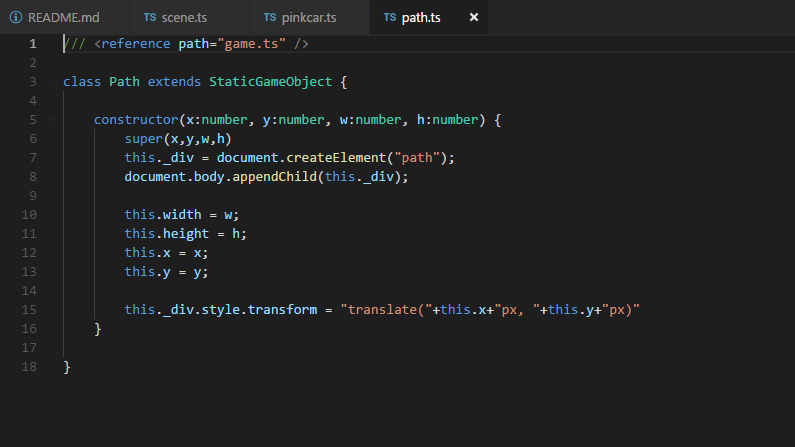
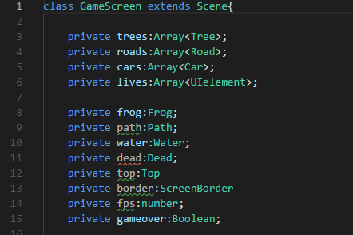
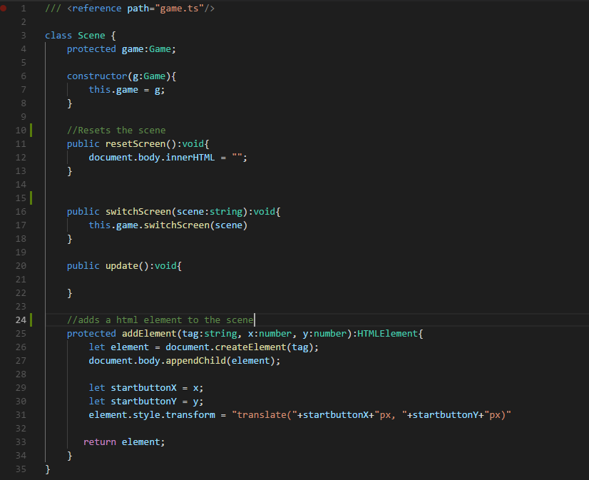
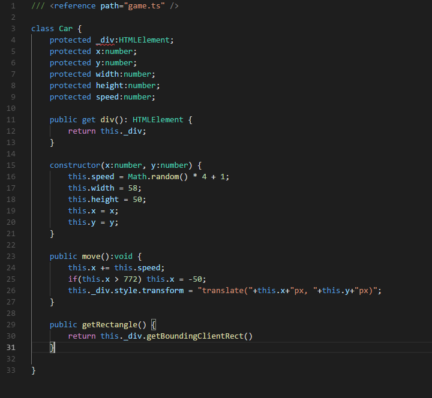
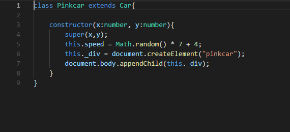
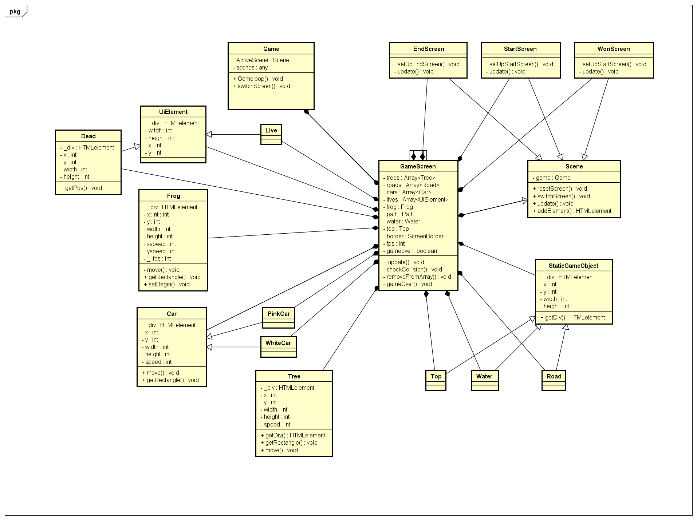

## **Froggy**

Mijn spel voor programmeren 4: Het is een simpele versie van de game Frogger. In dit spel 
is het de bedoeling dat je de overkant van de weg en het water bereikt. Er rijden auto's 
over de weg die je zult moeten ontwijken. Om aan de overkant van het water te komen zul je 
op de boomstammen moeten springen.

**Op het moment is het spel alleen speelbaar op Google Chrome.**
**Demo op:** [Sketch Runner](https://rickvanbuuren.github.io/froggy/)

#### Checklist
- [x] De code van het individuele project staat op GitHub.
- [x] De game is online speelbaar.
- [x] De game bevat minimaal één van de onderstaande extra uitdagingen.
- [x] De game heeft een startscherm en een eindscherm.
- [x] Er zijn geen bugs.
- [x] Het project maakt gebruik van deze OOP principes.
    - [x] Classes
    - [x] Encapsulation
    - [x] Composition
    - [x] Inheritance
- [x] De GitHub pagina bevat een ReadMe bestand. Dit bestand bevat:
- [x] Per bovengenoemd OOP principe een uitleg: waar is het toegepast, en waarom is het op die plek toegepast. De uitleg is inclusief code voorbeelden.
- [x] Een klassendiagram van de game.
- [x] Een link naar de peer review die in week 6 is gedaan

#### Extra opdrachten
- [x] De game ziet er zeer verzorgd uit dankzij goed uitgewerkt UI design en artwork.
- [ ] De game bevat een hiscore lijst. Scores worden bewaard nadat de game is afgesloten.
- [ ] De game werkt met Canvas in plaats van DOM elementen
- [ ] De game bevat local of online multiplayer.
- [ ] De game werkt op mobiele schermen en ondersteunt touchscreen controls.
- [ ] De game maakt gebruik van device api's zoals de camera, microfoon, gyroscoop of GPS.
- [x] De game gebruikt een externe library uit de lijst in deze modulewijzer.

De UI in deze game is precies zoals het in de orginale frogger eruit zag. 
Ik maak gebruik van geluid door middel van de library howler.js. 

Ik gebruik in dit spel alle technieken die we in de les hebben behandeld.
**Classes** 
In OOP programmeren wordt voor alles classes gebruikt. Met classes kan je variables(properties) en functies(methods) afschermen 
van andere delen van je code. Een class heeft zijn eigen logica, soms aangevuld door een parent class of interface. 

**Classes in mijn game:**
* Game
* Scene
* StartScreen
* GameScreen
* EndScreen
* WonScreen
* SaticGameObject
* Top
* Water
* Road
* Car
* PinkCar
* WhiteCar
* Tree
* Frog
* Dead
* UiElement
* Life

**Een voorbeeld van een class in mijn game:**

**Encapsulation:**
Encapsulation gebruik ik om mijn classes te beschermen en alles alleen beschikbaar te hebben in de juiste class.
Hiermee weet ik zeker dat de classes werken zoals ik ze gemaakt heb. 
Voor encapsulation kan je verschillende modifiers gebruiken om de juiste doel te bereiken. 

* **Private** dit gebruik je als je wilt dat de properties en/of method alleen beschikbaar zijn binnen de functie.

        class Object{
            // properties en methods hebben allemaal de private modifier ervoor staan
            private prop1:string;
            private prop2:number;
            
            private function()
            {
            
            }
        }

* **Protected** dit gebruik je bij inheritence. Hiermee maak je de properties en/of method van een parent class beschikbaar voor de class
die overerft van de parent. 

        class Object{
            // properties en methods hebben allemaal de protected modifier ervoor staan
            protected prop1:string;
            protected prop2:number;
            
            protected function()
            {
            
            }
        }

* **Public** dit gebruik je als je wilt dat de properties en/of method beschikbaar is voor iedereen die een class heeft geïnstantieerd.
        
        class Object{
            // properties en methods hebben allemaal de public modifier ervoor staan
            public prop1:string;
            public prop2:number;
            
            public function()
            {
            
            }
        }

Om je applicatie zo veilig mogelijk te schrijven is de standaard eigenlijk dat alles private is. Als je een propertie wilt kunnen ophalen of 
kunnen veranderen, maak je zogeheten getters en setters aan. Voor methods gebruik je public alleen als de methode buiten de class moet kunnen worden aangeroepen.
 
**Voorbeeld in eigen code:** 

Properties

Methods

**Composition:**
Composition gebruik je als je bepaalde classes aan elkaar wilt koppelen. Zo is er in mijn game een Game class die meerdere Scene classes heeft. Elke Scene class heeft weer de Game
nodig. De Game class wordt dan opgeslagen in een propertie van de Scene class.
 
voorbeeld:
    
    class Water{
        // propertie wordt voorbereid om een Fish object te krijgen
        private fish:Fish;
    
        // In de constructor word een Fish object meegegeven
        constructor(fish:Fish)
        {
            // propertie wordt gevult met de Fish object
            this.fish = fish;
        }
    }
    
    // Fish object
    class Fish{
        private x:number;
        private y:number;
        
        constructor(x:number,y:number)
        {
            this.x = x;
            this.y = y;
        }
    }
    
**Voorbeeld in eigen code**

Hier gebruik ik het specifiek zodat ik de functie switchscreen van de Game kan gebruiken binnen de Scene classes.

**Inheritence:**

Ik gebruik inheritence zodat ik geen code opnieuw hoef te schrijven. Ik maak een class waar de basis methods en properties in zitten. Ik kan deze class
dan gebruiken om op andere classes toe te passen. 

voorbeeld:

    class Animal{
        // De standaard properties van een dier
        protected name:string;
        protected noise:string;
        
        // In de constructor wordt alles gevuld
        constructor(name:string,noise:string)
        {
            this.name = name;
            this.noise = noise;
        }
        
        // Standaard method om geluid te maken (nu alleen een console.log)
        public makeNoise()
        {
            console.log(this.noise);            
        }
    }

    // class Dog erft alles van animal over
    class Dog extends Animal{
        constructor()
        {
            // Hier zetten we de naam en geluid van een hond
            super('hond','Woef!');            
        }
    }
    
    // Hond kan gebruik maken van de makeNoise method zonder hem zelf aan hoeven te maken
    let hond = new Dog();
    hond.makeNoise()

**Voorbeeld in eigen code:** 

De Class Car wordt door twee objecten gebruikt. In de Car class wordt er een update en x y width en height meegeven.    

De snelheid en het uiterlijk van de auto wordt hier veranderd.

#### **Klassendiagram**

#### Peer review
Link naar peer review:
[Dion Pisas](https://github.com/AdriaanGiel/sketch_runner/blob/master/Peer_Review_Dion_Pisas.md)
